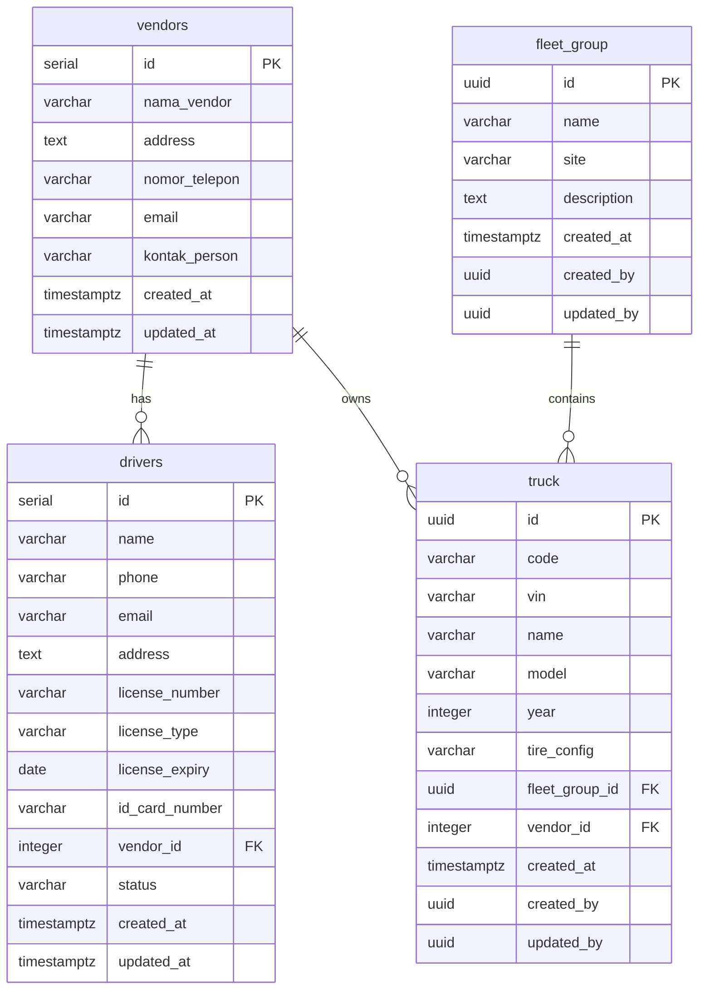

# TPMS Backend - Entity Relationship Diagram (ERD)

## 📊 Database Schema Overview

**Last Updated:** October 21, 2025  
**Database:** PostgreSQL 14+  
**Naming Convention:**
- **Database Columns:** `snake_case` (PostgreSQL Standard)
- **Application Code:** `camelCase` (JavaScript Standard)
- **Mapping:** Prisma `@map` directive

---

## 🗂️ Core Tables

### 1. **vendors**
Vendor/Company management for fleet operations.

| Column | Type | Constraints | Mapped Field (Code) | Description |
|--------|------|-------------|---------------------|-------------|
| `id` | SERIAL | PRIMARY KEY | `id` | Vendor unique identifier |
| `nama_vendor` | VARCHAR(255) | NOT NULL | `name` | Vendor/Company name |
| `address` | TEXT | NULLABLE | `address` | Physical address |
| `nomor_telepon` | VARCHAR(50) | NULLABLE | `phone` | Contact phone number |
| `email` | VARCHAR(255) | NULLABLE | `email` | Contact email |
| `kontak_person` | VARCHAR(255) | NULLABLE | `contactPerson` | Contact person name |
| `created_at` | TIMESTAMPTZ | DEFAULT NOW() | `createdAt` | Creation timestamp |
| `updated_at` | TIMESTAMPTZ | DEFAULT NOW() | `updatedAt` | Last update timestamp |

**Indexes:**
- `idx_vendors_nama` on `nama_vendor`

**Relationships:**
- **Has Many** `drivers` (1:N)
- **Has Many** `truck` (1:N)

---

### 2. **drivers**
Driver information including license and certification details.

| Column | Type | Constraints | Mapped Field (Code) | Description |
|--------|------|-------------|---------------------|-------------|
| `id` | SERIAL | PRIMARY KEY | `id` | Driver unique identifier |
| `name` | VARCHAR(255) | NOT NULL | `name` | Driver full name |
| `phone` | VARCHAR(50) | NULLABLE | `phone` | Driver phone number |
| `email` | VARCHAR(255) | NULLABLE | `email` | Driver email |
| `address` | TEXT | NULLABLE | `address` | Driver address |
| `license_number` | VARCHAR(50) | NOT NULL | `licenseNumber` | Driver license number |
| `license_type` | VARCHAR(20) | NOT NULL | `licenseType` | License type (SIM A, B1, B2, etc) |
| `license_expiry` | DATE | NOT NULL | `licenseExpiry` | License expiration date |
| `id_card_number` | VARCHAR(50) | NOT NULL | `idCardNumber` | National ID card number |
| `vendor_id` | INTEGER | FOREIGN KEY | `vendorId` | Reference to vendor |
| `status` | VARCHAR(20) | DEFAULT 'aktif' | `status` | Driver status (aktif/nonaktif) |
| `created_at` | TIMESTAMPTZ | DEFAULT NOW() | `createdAt` | Creation timestamp |
| `updated_at` | TIMESTAMPTZ | DEFAULT NOW() | `updatedAt` | Last update timestamp |

**Indexes:**
- `idx_drivers_vendor_id` on `vendor_id`
- `idx_drivers_status` on `status`
- `idx_drivers_license_expiry` on `license_expiry`

**Constraints:**
- `chk_drivers_status`: status IN ('aktif', 'nonaktif')

**Relationships:**
- **Belongs To** `vendors` via `vendor_id` (N:1)

**Foreign Keys:**
- `vendor_id` → `vendors.id` (ON DELETE SET NULL)

---

### 3. **fleet_group**
Fleet grouping for organizational structure.

| Column | Type | Constraints | Mapped Field (Code) | Description |
|--------|------|-------------|---------------------|-------------|
| `id` | UUID | PRIMARY KEY | `id` | Fleet group unique identifier |
| `name` | VARCHAR(255) | NOT NULL | `name` | Fleet group name |
| `site` | VARCHAR(255) | NULLABLE | `site` | Physical site/location |
| `description` | TEXT | NULLABLE | `description` | Group description |
| `created_at` | TIMESTAMPTZ | DEFAULT NOW() | `createdAt` | Creation timestamp |
| `created_by` | UUID | NULLABLE | `createdBy` | User who created record |
| `updated_by` | UUID | NULLABLE | `updatedBy` | User who last updated |

**Relationships:**
- **Has Many** `truck` (1:N)

---

### 4. **truck**
Truck/Vehicle master data with fleet management.

| Column | Type | Constraints | Mapped Field (Code) | Description |
|--------|------|-------------|---------------------|-------------|
| `id` | UUID | PRIMARY KEY | `id` | Truck unique identifier |
| `code` | VARCHAR(4) | UNIQUE | `code` | Short truck code (max 4 chars) |
| `vin` | VARCHAR(17) | UNIQUE | `vin` | Vehicle Identification Number |
| `name` | VARCHAR(255) | NULLABLE | `name` | Truck name/label |
| `model` | VARCHAR(255) | NULLABLE | `model` | Truck model |
| `year` | INTEGER | NULLABLE | `year` | Manufacturing year |
| `tire_config` | VARCHAR(255) | NULLABLE | `tireConfig` | Tire configuration |
| `fleet_group_id` | UUID | FOREIGN KEY | `fleetGroupId` | Reference to fleet group |
| `vendor_id` | INTEGER | FOREIGN KEY | `vendorId` | Reference to vendor |
| `created_at` | TIMESTAMPTZ | DEFAULT NOW() | `createdAt` | Creation timestamp |
| `created_by` | UUID | NULLABLE | `createdBy` | User who created record |
| `updated_by` | UUID | NULLABLE | `updatedBy` | User who last updated |

**Indexes:**
- `idx_truck_code` on `code` (UNIQUE)
- `idx_truck_vin` on `vin` (UNIQUE)
- `idx_truck_vendor_id` on `vendor_id`
- `idx_truck_fleet_group_id` on `fleet_group_id`

**Constraints:**
- `chk_truck_vin_format`: VIN exactly 17 characters, pattern `[A-HJ-NPR-Z0-9]+`
- `chk_truck_code_format`: code max 4 characters, pattern `[A-Z0-9]+`

**Relationships:**
- **Belongs To** `vendors` via `vendor_id` (N:1)
- **Belongs To** `fleet_group` via `fleet_group_id` (N:1)
- **Has Many** device, gps_position, tire_pressure_event, alert_event, etc.

**Foreign Keys:**
- `vendor_id` → `vendors.id` (ON DELETE SET NULL)
- `fleet_group_id` → `fleet_group.id` (ON DELETE NO ACTION)

---

## 🔗 Relationship Diagram (Text)

```
┌─────────────────┐
│   fleet_group   │
│  (UUID PK)      │
└────────┬────────┘
         │
         │ 1:N
         │
         ▼
┌─────────────────┐        ┌─────────────────┐
│    vendors      │        │     truck       │
│  (SERIAL PK)    │◄───────│   (UUID PK)     │
└────────┬────────┘   N:1  └─────────────────┘
         │
         │ 1:N
         │
         ▼
┌─────────────────┐
│    drivers      │
│  (SERIAL PK)    │
└─────────────────┘
```

**Legend:**
- `◄───────` : Foreign Key relationship
- `1:N` : One-to-Many relationship

---

## 📋 Detailed Relationships

### **vendors → drivers**
- **Type:** One-to-Many (1:N)
- **Foreign Key:** `drivers.vendor_id` → `vendors.id`
- **On Delete:** SET NULL
- **Business Rule:** A vendor can have multiple drivers, but a driver belongs to one vendor

### **vendors → truck**
- **Type:** One-to-Many (1:N)
- **Foreign Key:** `truck.vendor_id` → `vendors.id`
- **On Delete:** SET NULL
- **Business Rule:** A vendor can own multiple trucks, but a truck belongs to one vendor

### **fleet_group → truck**
- **Type:** One-to-Many (1:N)
- **Foreign Key:** `truck.fleet_group_id` → `fleet_group.id`
- **On Delete:** NO ACTION
- **Business Rule:** A fleet group contains multiple trucks, but a truck belongs to one fleet group

---

## 🎨 ERD Diagram Tools Recommendations

### Option 1: Draw.io / Diagrams.net
**Export Format:** XML, PNG, SVG
**Steps:**
1. Create new diagram
2. Use "Entity Relation" shapes
3. Add tables with columns
4. Connect with relationship lines
5. Add crow's foot notation for cardinality

### Option 2: dbdiagram.io
**Code to paste:**
```dbml
Table vendors {
  id integer [pk, increment]
  nama_vendor varchar(255) [not null, note: 'name in code']
  address text
  nomor_telepon varchar(50) [note: 'phone in code']
  email varchar(255)
  kontak_person varchar(255) [note: 'contactPerson in code']
  created_at timestamptz [default: `now()`]
  updated_at timestamptz [default: `now()`]
  
  indexes {
    nama_vendor [name: 'idx_vendors_nama']
  }
}

Table drivers {
  id integer [pk, increment]
  name varchar(255) [not null]
  phone varchar(50)
  email varchar(255)
  address text
  license_number varchar(50) [not null, note: 'licenseNumber in code']
  license_type varchar(20) [not null, note: 'licenseType in code']
  license_expiry date [not null, note: 'licenseExpiry in code']
  id_card_number varchar(50) [not null, note: 'idCardNumber in code']
  vendor_id integer [ref: > vendors.id, note: 'vendorId in code']
  status varchar(20) [default: 'aktif']
  created_at timestamptz [default: `now()`]
  updated_at timestamptz [default: `now()`]
  
  indexes {
    vendor_id [name: 'idx_drivers_vendor_id']
    status [name: 'idx_drivers_status']
    license_expiry [name: 'idx_drivers_license_expiry']
  }
}

Table fleet_group {
  id uuid [pk]
  name varchar(255) [not null]
  site varchar(255)
  description text
  created_at timestamptz [default: `now()`]
  created_by uuid
  updated_by uuid
}

Table truck {
  id uuid [pk]
  code varchar(4) [unique]
  vin varchar(17) [unique]
  name varchar(255)
  model varchar(255)
  year integer
  tire_config varchar(255) [note: 'tireConfig in code']
  fleet_group_id uuid [ref: > fleet_group.id, note: 'fleetGroupId in code']
  vendor_id integer [ref: > vendors.id, note: 'vendorId in code']
  created_at timestamptz [default: `now()`]
  created_by uuid
  updated_by uuid
  
  indexes {
    code [unique, name: 'idx_truck_code']
    vin [unique, name: 'idx_truck_vin']
    vendor_id [name: 'idx_truck_vendor_id']
    fleet_group_id [name: 'idx_truck_fleet_group_id']
  }
}
```

### Option 3: Mermaid.js (for GitHub/Markdown)


### Option 4: Lucidchart
- Professional diagramming tool
- Supports PostgreSQL import
- Can use SQL file to auto-generate

---

## 📊 Sample Queries

### Get vendors with driver and truck counts:
```sql
SELECT 
    v.id,
    v.nama_vendor as name,
    v.nomor_telepon as phone,
    v.email,
    COUNT(DISTINCT d.id) as driver_count,
    COUNT(DISTINCT t.id) as truck_count
FROM vendors v
LEFT JOIN drivers d ON d.vendor_id = v.id AND d.status = 'aktif'
LEFT JOIN truck t ON t.vendor_id = v.id
GROUP BY v.id;
```

### Get drivers with expiring licenses:
```sql
SELECT 
    d.name,
    d.license_number,
    d.license_type,
    d.license_expiry,
    d.license_expiry - CURRENT_DATE as days_until_expiry,
    v.nama_vendor as vendor_name
FROM drivers d
LEFT JOIN vendors v ON d.vendor_id = v.id
WHERE d.status = 'aktif' 
  AND d.license_expiry BETWEEN CURRENT_DATE AND CURRENT_DATE + INTERVAL '30 days'
ORDER BY d.license_expiry ASC;
```

### Get truck fleet overview:
```sql
SELECT 
    t.code,
    t.name,
    t.model,
    t.year,
    v.nama_vendor as vendor_name,
    fg.name as fleet_group_name,
    fg.site
FROM truck t
LEFT JOIN vendors v ON t.vendor_id = v.id
LEFT JOIN fleet_group fg ON t.fleet_group_id = fg.id
ORDER BY t.code;
```

---

## 🔍 Field Mapping Reference

Quick reference for developers working between database and code:

| Database Column | Code Field | Table |
|----------------|------------|-------|
| `nama_vendor` | `name` | vendors |
| `nomor_telepon` | `phone` | vendors |
| `kontak_person` | `contactPerson` | vendors |
| `license_number` | `licenseNumber` | drivers |
| `license_type` | `licenseType` | drivers |
| `license_expiry` | `licenseExpiry` | drivers |
| `id_card_number` | `idCardNumber` | drivers |
| `vendor_id` | `vendorId` | drivers, truck |
| `tire_config` | `tireConfig` | truck |
| `fleet_group_id` | `fleetGroupId` | truck |
| `created_at` | `createdAt` | All |
| `updated_at` | `updatedAt` | vendors, drivers |
| `created_by` | `createdBy` | fleet_group, truck |
| `updated_by` | `updatedBy` | fleet_group, truck |

---

## 📝 Notes

1. **UUID vs SERIAL:**
   - `vendors`, `drivers`: Use SERIAL (auto-increment integer)
   - `truck`, `fleet_group`: Use UUID for distributed systems

2. **Soft Delete:**
   - Drivers use `status` field ('aktif'/'nonaktif')
   - Trucks use separate `truck_status_event` table

3. **Timestamps:**
   - All tables have `created_at`
   - Some tables have `updated_at` with auto-update trigger
   - Some tables track `created_by` and `updated_by` for audit

4. **Naming Convention:**
   - Database follows PostgreSQL snake_case convention
   - Application code follows JavaScript camelCase convention
   - Prisma @map bridges the two conventions seamlessly

---

## 🚀 Next Steps

1. **Generate Visual Diagram:**
   - Use dbdiagram.io code above
   - Or import SQL file into Lucidchart
   - Or use Draw.io with provided table structures

2. **Add to Documentation:**
   - Export PNG/SVG for README
   - Add to API documentation
   - Share with frontend team

3. **Keep Updated:**
   - Update this file when schema changes
   - Regenerate diagrams after migrations
   - Maintain field mapping reference

---

**Generated:** October 21, 2025  
**Version:** 1.0  
**Maintainer:** TPMS Backend Team
